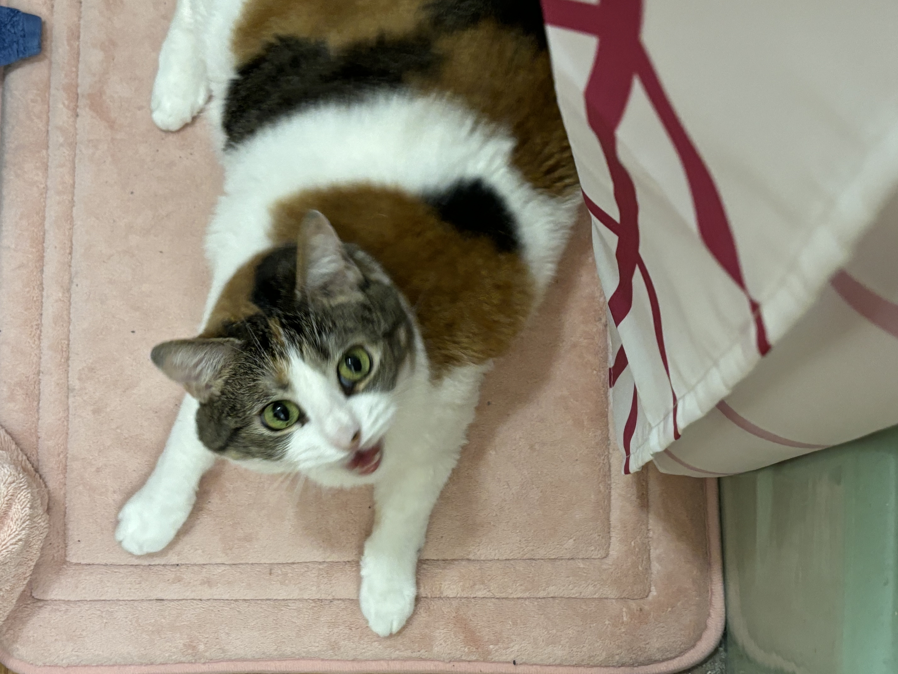

# Caylee Spivey Demo Page

## Courses Taught
- Calc 1
- Calc 2
- Problem Solving

## Cats Owned
- Daisy
- Tabby
- Charlie
- Sheldon

[My Math Home Page](https://math.uconn.edu)



```python
def fib(n):
  if n==0:
    return 1
